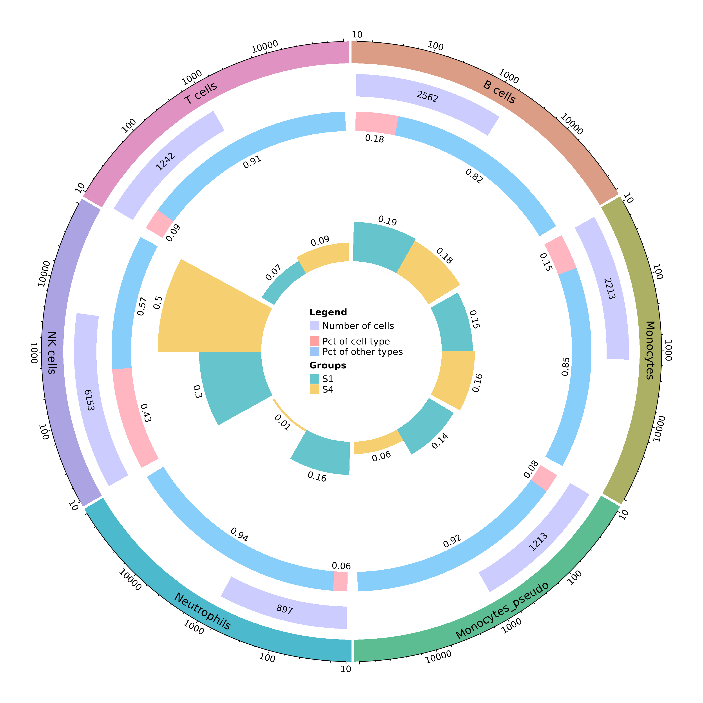

# **cellPCT**

An R package for Multi-visualization of single-cell RNA-seq cell type.

This package provide multiple visualizations for scRNA-seq cell type ratio. Including sankey plot, stackbar plot, stackline plot, multidonut plot, singledonut plot, circle plot, rose plot, treemap plot, radar plot and milticircle plot. Each plot type can choose multi parameters to fit users' demands. Like label showing, coord flip, hide cell type which ratio less assigned value, order the group and cell type for plotting, et al. More details please see the description of 'plot_xx' functions.

# 1. Installation

## 1.1 Dependencies

|  Packages  |  Version  |
|  :-------: |  :-----:  |
|    dplyr   |   1.1.3   |
| SeuratObject |  4.1.3  |
|   ggplot2  |   3.4.3   |
|   forcats  |   1.0.0   |
| ggalluvial |  0.12.5   |
|  cols4all  |   0.6     |
| treemapify |   2.5.5   |
|   ggradar  |    0.2    |
|  circlize  |   0.4.15  |
|ComplexHeatmap| 2.14.0  |
|   grid     |   4.2.3   |

## 1.2 Install from source

`install.packages('/path/to/package/source/cellPCT_0.2.1.tar.gz', repos = NULL, dependencies = T)`

## 1.3 Install from github

`devtools::install_github('DynamicBiosystems/cellPCT')`

# 2. Quickstart

### 2.1 Please cheack example_data to ensure your input data format

`library(cellPCT)`

`example_data`

| cell_type |	S1	| S2 |	S3	| S4 |
| :-------: |  :-----:  | :-----: | :-----: | :-----: |
| NK cells  |    1425	|    291  |   5118  |   4728  |
| Monocytes	|   696	    |  4052	  |   459	|   1517  |
|  B cells	|    895	|   3470  |	  495	|   1667  |
|Neutrophils|	756	    |   1842  |	107	    |    141  |
| T cells	|    342	|   76	  |   539	|   900   |
|Monocytes_pseudo|	670	| 486	  |  654	|   543   |
|Plasma cells|	113	    |   236	  |   97	|   311   |
|Eosinophils_pseudo|	95|	37|	175|	118|
|Platelets	|39|120| 45| 45|
|pDCs	|59|28|79|7|

### 2.2 Plot and save all kinds of virsualizations 

## Usage

`?plot_all`

### Arguments

|  Parameters  |  Description  |
|  :--------: |  :-----:  |
|    input   |   the input data rds,txt,csv can be use   |
| outdir |  the output files' path  |
|    cell_type   |   the colname of cell in input data   |
| sample |  the colname of sample in input data  |

## In one line by running:

`plot_all(example_data, outdir = '/path/to/plot/save/dir/')`

# 3. Usage and Result

### Arguments

|  Parameters  |Functions |  Description  |
|  :--------: |:-----: | :-----:  |
|    input   | all  |input data, Seurat obj or data.frame can be use.   |
| group_by | all |colname of Seurat metadata, which represent the groups or samples.  |
|    cell_type |  all |   colname of Seurat metadata, which represent the cell type.   |
| sub_sample | all | select part of the groups for plot, default is 'all'.  |
|    sub_type | all |   select part of the cell types for plot, default is 'all'.   |
| order_sample | all | reorder the samples, default is "default".  |
|    order_type |  all |   reorder the cell type, default is "default".   |
| coord_flip | plot_sankey | whether to flip the coord, default is FALSE.  |
|group	|  plot_stackbar  | whether use group as legend, default is FALSE. |
| min_percent |  plot_circle, plot_singledonut, plot_mutidonut	| the minimum percent. use to combine some cell type with low ratio, default is 0. |
| lab | plot_circle, plot_singledonut, plot_mutidonut	| whether to show the label on the plot, default is TRUE. |

## 3.1 Sankey plot

## Usage

`?plot_sankey`

## Result

`plot_sankey(example_data, coord_flip = T)`

`plot_sankey(example_data, sub_sample = c('S1','S2','S3'),coord_flip = F)`

`plot_sankey(example_data,sub_sample = c('S1','S3'),sub_type = c('NK cells','B cells','T cells','Monocytes'), coord_flip = T)`

## 3.2 Stackbar plot

## Usage

`?plot_stackbar`

## Result

`plot_stackbar(example_data)`

`plot_stackbar(example_data,group = T)`

`plot_stackbar(example_data, sub_sample = c('S3','S4'), sub_type = c('NK cells','B cells','T cells','Monocytes'), order_sample = c('S4','S3'), order_type = c('T cells','B cells','Monocytes','NK cells')`

## 3.3 Stackline plot

## Usage

`?plot_stackline`

### Arguments

## Result

`plot_stackline(example_data)`

`plot_stackline(example_data, sub_sample = c('S1','S2'))`

## 3.4 Circle plot

## Usage

`?plot_circle`

## Result

`plot_circle(example_data, sub_sample = c('S1'), lab = T)`

`plot_circle(example_data, sub_sample = c('S1'),sub_type = c('NK cells','B cells','T cells','Monocytes'), lab = F)`

## 3.5 SingleDonut plot

## Usage

`?plot_singledonut`

## Result

`plot_singledonut(example_data, lab = F)`

`plot_singledonut(example_data, sub_sample = c('S1','S4'), min_percent = 5, lab = T)`

## 3.6 MultiDonut plot

## Usage

`?plot_mutidonut`

## Result

`plot_mutidonut(example_data, lab = F)`

`plot_mutidonut(example_data,min_percent = 5, lab = T)`

## 3.7 Rose plot

## Usage

`?plot_rose`

## Result

`plot_rose(example_data, sub_sample = c('S1'))`

## 3.8 Treemap plot

## Usage

`?plot_treemap`

## Result

`plot_treemap(example_data, sub_sample = c('S1'))`

## 3.9 Radar plot 

## Usage

`?plot_radar`

## Result

`plot_radar(example_data)`

`plot_radar(example_data,sub_sample = c('S1','S3'), sub_type = c('NK cells','B cells','T cells','Monocytes'))`

## 3.10 Multicircle plot

## Usage

`?plot_multicircle`

## Result

`plot_multicircle(example_data,outdir = './save/',sub_type = c('NK cells','Monocytes','B cells','Neutrophils','T cells','Monocytes_pseudo'))`

`plot_multicircle(example_data, sub_sample = c('S1','S4'), sub_type = c('NK cells','Monocytes','B cells','Neutrophils','T cells','Monocytes_pseudo'), outdir = './save/')`

## Changelog
